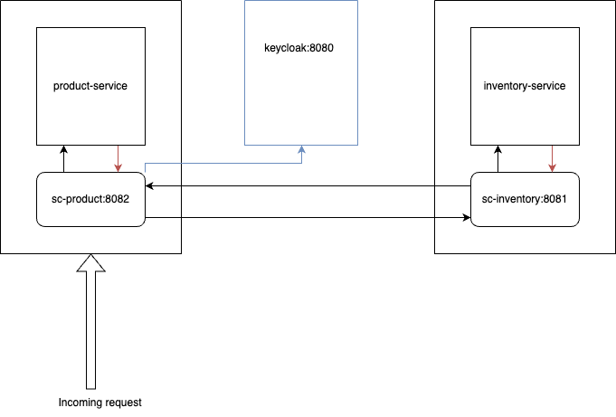

# envoy-proxy-sidecar

This demo shows capabilities of envoy proxy sidecar, 
in a service-to-service communication, between product service (written in python) 
and inventory service (written in java). Also, how jwt token validation can be done on the sidecar side, 
as well as logging using custom filter written in Lua.

## Architecture of the system


product-service is a proxy service which validates token issued by keycloak, and sends request to inventory-service through its sidecar

## Building the docker images of the components
```shell
docker build -t inventory-app .
docker build -t product-app .
docker build -t sc-invetory .
docker build -t sc-product .
```
 ## Run all modules
```shell
docker-compose up -d
```
